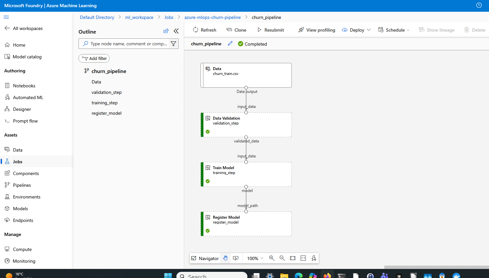

# 🚀 Azure MLOps Churn Prediction Pipeline

[]()
[]()
[]()
[]()

End-to-end **MLOps pipeline** for churn prediction using **Azure Machine Learning**, including training, experiment tracking, model registry, deployment, and monitoring.

---

## 📌 Overview

This project demonstrates a **production-ready MLOps system** built on Azure Machine Learning, covering the full lifecycle:

- Data validation and quality checks
- Model training and experiment tracking (MLflow)
- Automated pipeline orchestration (Azure ML pipelines)
- Model registration and deployment
- Real-time inference via REST API
- Monitoring and data drift detection

The project emphasizes reproducibility, modular design, and separation between training, orchestration, and deployment.

---

## 🔄 Azure ML Pipeline

This project includes a fully orchestrated **Azure ML pipeline** that automates the end-to-end workflow:

### Pipeline Steps

1. **Data Validation**
   - Validates input data using Great Expectations
   - Outputs a validated dataset

2. **Training**
   - Trains a LightGBM model
   - Logs metrics and artifacts with MLflow
   - Saves model as pipeline artifact

3. **Model Registration**
   - Registers the trained model in Azure ML Model Registry

---

### ▶️ Run the pipeline

```bash
python src/pipeline.py \
  --subscription_id <your-subscription-id> \
  --resource_group <your-resource-group> \
  --workspace_name <your-workspace>
```

### 🔁 Pipeline Flow
raw data → validation → training → model artifact → registration


*Azure ML pipeline execution showing validation, training, and model registration steps.*



---

## 🧠 Architecture

High-level overview of the end-to-end MLOps pipeline.

```text
Raw Data
   ↓
Validation (Great Expectations)
   ↓
Training (LightGBM + MLflow)
   ↓
Model Artifact
   ↓
Azure ML Registry
   ↓
Deployment (Managed Endpoint)
   ↓
Inference API
   ↓
Monitoring (Evidently)
```

---

## ⚙️ Tech Stack

* Python 3.10
* Azure Machine Learning (SDK v2)
* MLflow
* LightGBM
* Pandas / NumPy
* Evidently (monitoring)

---

## 📂 Project Structure

```
src/
├── data/
│   └── generate_data.py
├── azure_mlflow_utils.py   # Azure ML + MLflow integration utilities
├── data_validation.py      # Data validation using Great Expectations
├── train.py
├── hpo.py
├── register_model.py
├── deploy.py
├── score.py
├── monitor_drift.py

scripts/
└── test_endpoint.py

data/
├── raw/
├── production/

tests/
├── test_generate_data.py
├── test_data_validation.py

conda.yaml
pyproject.toml
requirements.txt
```

### Azure ML Integration

This project uses a helper module:

```bash
src/azure_mlflow_utils.py
```  

to:

- connect MLflow to Azure ML workspace
- configure tracking URI
- simplify authentication

---

## 📁 Data

This project uses synthetic data generated locally.

Data is **not stored in the repository**. Instead, generate it using:

```bash
python src/data/generate_data.py --output_path data/raw/churn_train.csv
```

The expected structure is:

```
data/
├── raw/         # training data
├── production/  # simulated production data (for monitoring)
```

---

## ✅ Data Validation

This project includes a validation step using **Great Expectations** to ensure data quality before training.

Validation checks include:

* schema consistency
* missing values
* basic feature constraints

### ▶️ Run validation

```bash
python src/data_validation.py \
  --input_path data/raw/churn_train.csv
```

### ✔ Example output

```text
Validation successful: dataset passed all checks
```

If validation fails, the pipeline stops before training.

---

## 🏋️ Training

```bash
python src/train.py
```

---

## 🔍 Hyperparameter Tuning

```bash
python src/hpo.py
```

---

## 📦 Register Model

```bash
python src/register_model.py
```

---

## 🚀 Deploy Model

```bash
python src/deploy.py \
  --subscription_id $SUBSCRIPTION_ID \
  --resource_group $RESOURCE_GROUP \
  --workspace_name $WORKSPACE_NAME \
  --endpoint_name churn-endpoint \
  --model_name churn_model \
  --model_version 4
```

---

## 🔌 Test Endpoint

```bash
python scripts/test_endpoint.py
```

Example response:

```json
{"predictions": [1]}
```

---

## 📊 Monitoring

```bash
python src/monitor_drift.py \
  --reference_path data/raw/churn_train_clean.csv \
  --current_path data/production/churn_prod_drifted.csv
```

---

## 🧹 Code Quality
  
This project uses Ruff for linting:  

```bash
ruff check .
```

---

## 🧪 Testing
  
Run unit tests with:
  
```bash
pytest
```

---

## Environment

The project uses a conda environment compatible with Azure ML pipelines.  

It includes:
- `mlflow` for experiment tracking  
- `azureml-mlflow` for Azure ML integration  
- `azure-ai-ml` for pipeline orchestration and model registry  

---

## ⚠️ Key Learnings

* Environment consistency between training and inference is critical
* MLflow model structure requires correct loading (`/model` path)
* Azure ML environments can have non-obvious dependency resolution behavior
* Proper dependency pinning avoids runtime failures

---

## 📈 Future Improvements

* CI/CD pipeline (GitHub Actions)
* Automated retraining
* Alerting on drift detection
* Batch inference pipeline

---

## 📄 License

MIT License

---

## 👤 Author

Lorenzo

